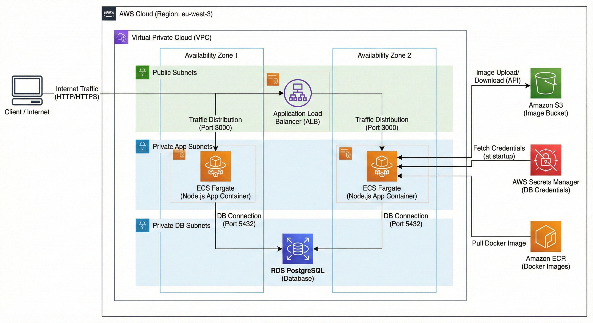

# AWS Product Inventory API

A cloud-native Serverless API built with Node.js, Docker, and Terraform on AWS. This project demonstrates a production-ready architecture using ECS Fargate, Application Load Balancer, RDS PostgreSQL, and S3 for image storage.

## What it Does

This application serves as a product inventory management system. It exposes a RESTful API that allows users to:

1.  **Check System Health:** Provides a dedicated endpoint for monitoring system status and uptime.
2.  **Initialize the Database:** Automatically sets up the necessary database schema (tables) in PostgreSQL without manual SQL execution.
3.  **Manage Products:** Users can create new product entries including names and prices.
4.  **Handle Media:** Users can upload product images directly via the API. These images are securely offloaded to object storage (S3), keeping the application stateless and lightweight.
5.  **Retrieve Data:** Users can list all stored products, receiving JSON data that includes the public URLs to the stored images.

## Architecture Diagram

The following diagram illustrates the high-level architecture and data flow of the application.



## How it Works

The system relies on a fully automated infrastructure-as-code approach using Terraform to provision a secure, scalable AWS environment.

### 1. Compute Layer (ECS Fargate)
The application logic (Node.js) runs inside Docker containers managed by Amazon ECS (Elastic Container Service) with the Fargate launch type.
* **Why Fargate?** It removes the need to manage EC2 instances. AWS handles the underlying patching and scaling of the servers.
* **Scalability:** The architecture is designed to scale horizontally. If traffic increases, ECS can launch more container replicas.

### 2. Networking & Traffic Distribution (ALB & VPC)
* **VPC:** The entire system lives inside a Virtual Private Cloud (VPC) with distinct public and private subnets across two Availability Zones for high availability.
* **Application Load Balancer (ALB):** Serves as the entry point. It sits in the public subnets, accepts traffic from the internet, and distributes it evenly among the Fargate containers running in the private subnets.
* **Security:** The ALB is the only resource directly accessible from the internet. The application containers accept traffic *only* from the ALB.

### 3. Data Persistence (RDS PostgreSQL)
Product data (names, prices, image references) is stored in an Amazon RDS PostgreSQL database.
* **Isolation:** The database resides in a dedicated private subnet layer, completely isolated from the internet.
* **Connectivity:** Only the ECS containers allowlisted via Security Groups can establish a connection to port 5432.
* **Security:** Database credentials are never hardcoded. They are generated randomly during deployment, stored in AWS Secrets Manager, and injected securely into the containers at runtime.

### 4. Object Storage (S3)
Product images are not stored on the servers or in the database. Instead, the application streams uploaded files directly to an S3 bucket.
* **Statelessness:** This ensures that if a container crashes or is replaced, no data is lost.
* **Delivery:** The application generates public URLs for the images, allowing clients to download them directly from S3.

## Prerequisites

Before deploying, ensure the following are installed and configured:

* Terraform (v1.0+)
* Docker Desktop (Running)
* AWS CLI (Configured with `aws configure`)
* Node.js (Optional, for local testing)

## Deployment Guide

### Phase 1: Infrastructure & Database
1.  Navigate to the terraform directory:
    ```bash
    cd terraform
    ```
2.  Initialize Terraform:
    ```bash
    terraform init
    ```
3.  Deploy the VPC, ECR, and RDS modules first:
    ```bash
    terraform apply
    ```
    *Note: This will output the ECR Repository URL and Database details.*

### Phase 2: Build & Push Docker Image
1.  Authenticate Docker with AWS ECR:
    ```bash
    aws ecr get-login-password --region eu-west-3 | docker login --username AWS --password-stdin <YOUR_AWS_ACCOUNT_ID>.dkr.ecr.eu-west-3.amazonaws.com
    ```
2.  Build the image (AMD64 is required for Fargate):
    ```bash
    cd ../app
    docker build --platform linux/amd64 -t product-inventory-api:v2 .
    ```
3.  Tag and Push the image:
    ```bash
    docker tag product-inventory-api:v2 <YOUR_ECR_REPO_URL>:v2
    docker push <YOUR_ECR_REPO_URL>:v2
    ```

### Phase 3: Deploy App & Load Balancer
1.  Return to the terraform directory:
    ```bash
    cd ../terraform
    ```
2.  Apply the remaining infrastructure (ALB + ECS):
    ```bash
    terraform apply
    ```
3.  Terraform will output your `app_url`.

## API Usage

Once deployed, use the `app_url` to interact with the API.

### Initialize Database
Creates the necessary tables in PostgreSQL.
* **GET** `/init-db`

### Health Check
Used by the Load Balancer to check status.
* **GET** `/health`

### Create Product
Uploads an image to S3 and saves metadata to RDS.
* **POST** `/products`
* **Body (form-data):**
    * `name`: (String)
    * `price`: (Number)
    * `image`: (File)

### List Products
* **GET** `/products`

## Security Notes

* **Secrets Management:** Database passwords are automatically generated and stored in AWS Secrets Manager. They are passed to the container environment only at runtime.
* **Least Privilege:** Security Groups allow minimal required traffic. The database only accepts traffic from the ECS Security Group.
* **Private Network:** The database and application logic reside in private subnets, shielding them from direct internet access.